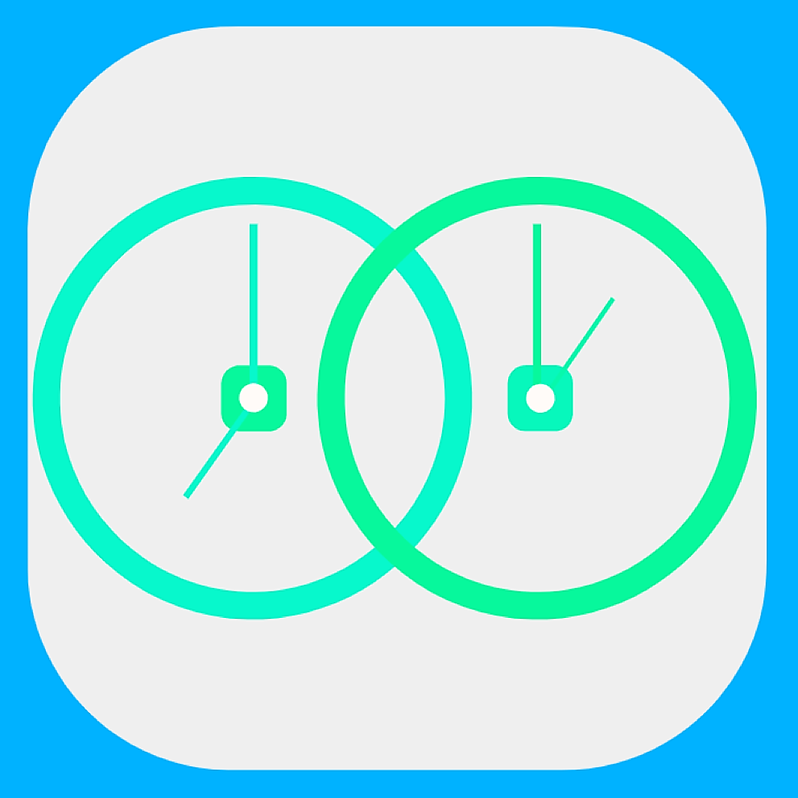
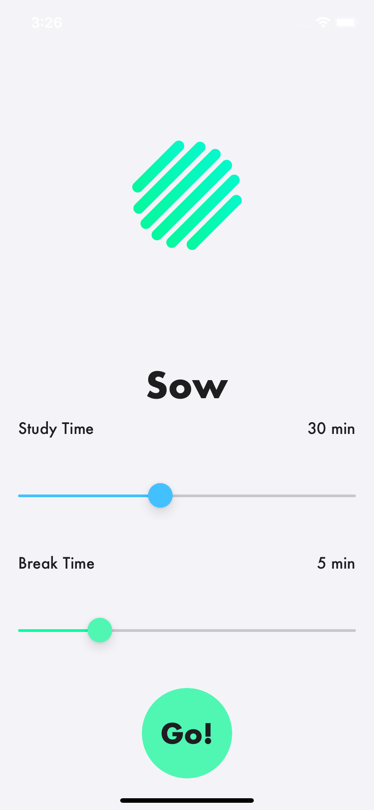
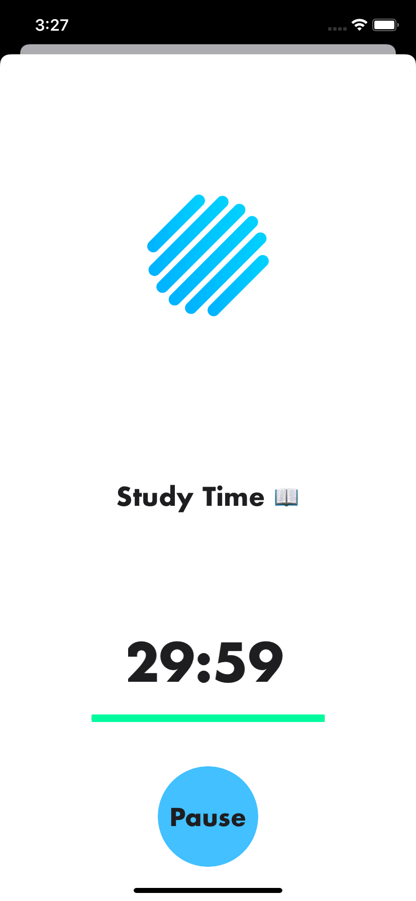
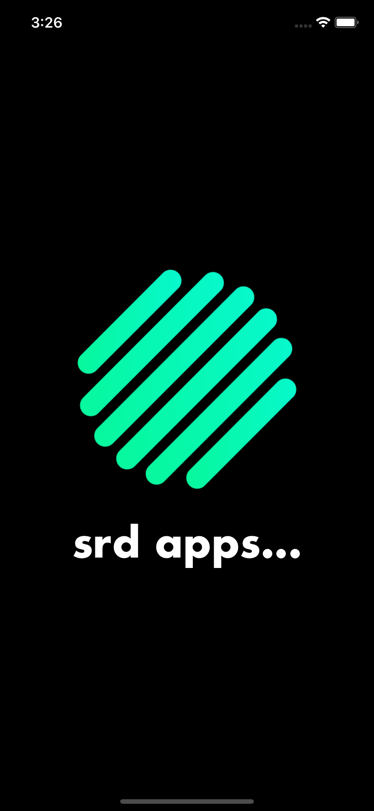
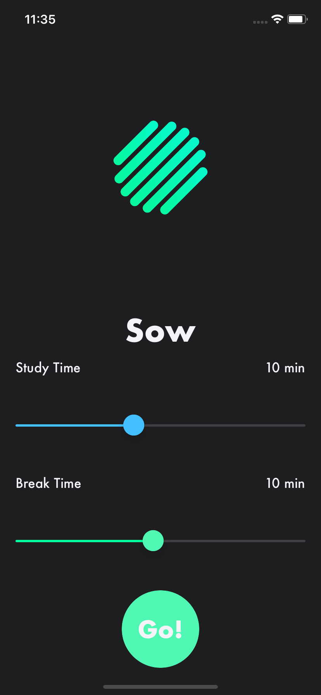
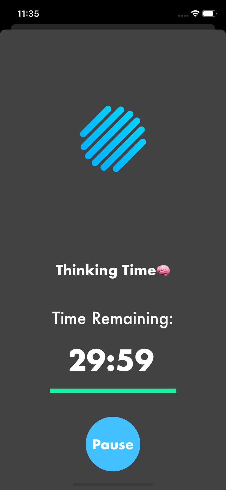

 
  

  

# Sow!

# Authors
  Developed by Luke Sirand  
  Logos and backgrounds by Cole Grodnitzky 
  
# About the App
For many of us, the work/learn from home environment has been a challenge in terms of staying focused. With TV's, videogames, social media, and even food steps away from where we work, it's easy to get distracted. On top of that, not having to attend classes/answer to a boss has allowed some to reach unheard of levels of procrastination. Sow is a timer iOS app that utilizes a modified version of the pomodoro technique, a studying technique used to maximize productivity and minimize procrastination. The user is able to use the app to set two timers, one allocated to the amount of time they would like to work, and another to reward them with a short break. This timer switches automatically between the two timers, sending visuals, audio queues, and push down notificiations in order to notify the user. The application's UI also changes its colors based on the time of day (day and night mode), allowing less strain on the user when studying at night.   

# Images

  

 

